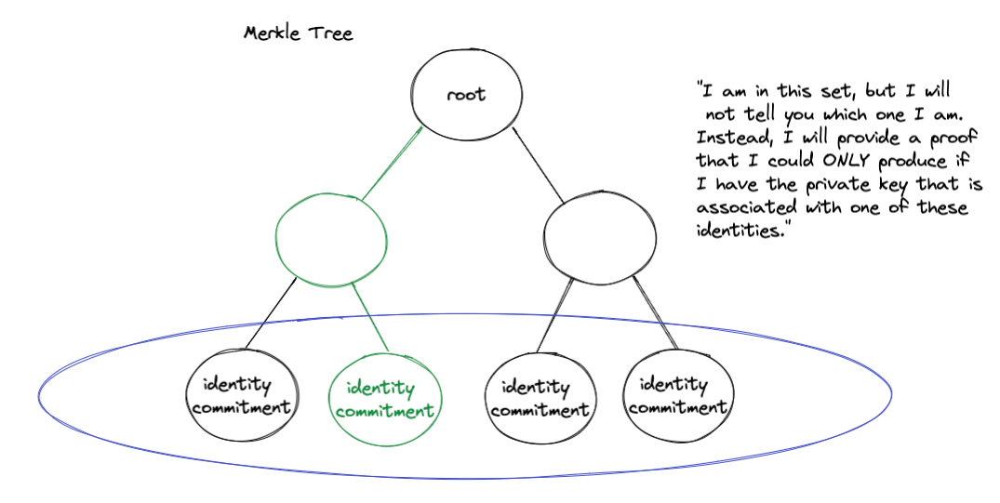

# Zero Knowledge Private Voting V1

## Motivation
On-chain governance today is fully transparent at the cost of privacy. This means that every proposal and vote can be trivially mapped to the public key who cast that vote. And because the entire transaction history of each wallet is public on chain, it is difficult to seperate the key identity from IRL identity.

In todays on-chain governance, a contrarian voter may have their decision swayed if they feared social backlash from the community. This demo implementation shows how you can use zero-knowledge proofs to anonymize the sender of a vote or proposal while still maintaining authorization rules.

## How does it work?
This project heavily leans on the [semaphore library](https://semaphore.appliedzkp.org/) which provides the contracts to verify a merkle proof of inclusion along with the js libraries to generate the proofs in browser.

The demo uses a zero-knowledge proof of inclusion in a set of holders of an NFT collection without revealing the id of the token they own or their public key. First a user that holds the NFT will have to register their identity with the smart contract by submitting a identityCommitment, this is then appended to the on-chain merkle tree. 

> I am in this set, but I will not tell you which one I am. Instead, I will provide a proof that I could ONLY produce if I have the private key that is associated with one of the registered identities.
> 


## Next Steps
1. The end goal for this project is to have a full on-chain governance that has optional or default privacy features. To acheive this goal, we plan on forking the Governor Bravo contracts to use this merkle inclusion proof as the authentication mechanism. 

1. In traditional democratic voting systems, votes are cast privately and accumulated before any results are publicly announced. An additional commit-reveal scheme could be used in tandem to the private voting to enable this feature in an on-chain governance system as well. 

1. The current system uses a 1 token = 1 vote scheme, this was primarily for simplicity in the POC. Eventually, there should be a way to vote based on your actual voting power and all at once. The downside of allowing users to vote with their exact token balance is that it might reveal some information about who is casting the vote. An alternative strategy could be allow votes in uniform "chunks" so that no single vote transaction stands out from the rest. 

---

## Installation

Clone the repository
```bash
git clone git@github.com:BlockchainCapital-dev/zk-vote.git
```

Install the dependencies
```bash
cd zk-vote
yarn install 
```

Run local hardhat instance and deploy the contracts
```bash
yarn chain 
yarn deploy 
```

Generate types for contracts: 
```bash
yarn contracts:build
```

Launch the frontend demo
```bash
yarn start
```
---
## Disclaimer
Contracts written here are un-audited and are presented for demonstration purposes only. These contracts are not considered production ready. If you or your team is looking to implement on chain governance with privacy features, reach out to ryan@blockchaincapital.com